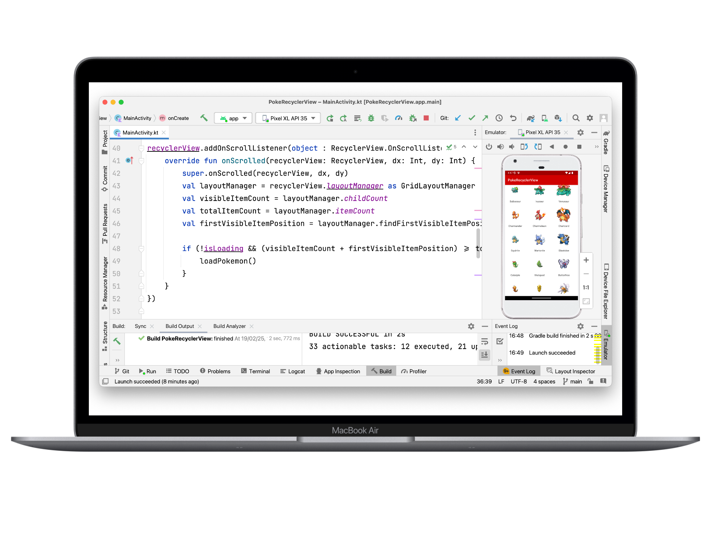
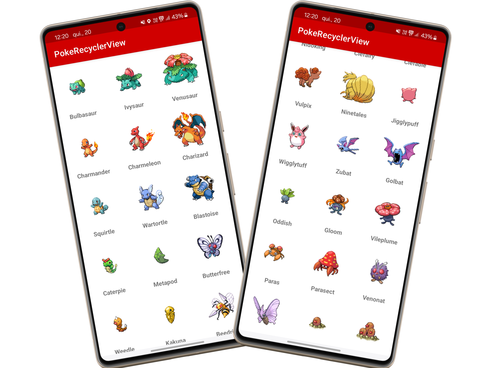

# 📌 Projeto: PokeRecyclerView

<p align="center">
  
</p>

Este projeto foi desenvolvido como parte de um **trabalho universitário** para demonstrar o uso do **RecyclerView** no Android. O aplicativo exibe uma lista de Pokémon utilizando a **PokeAPI**, implementando **scroll infinito** e um layout em **grade (GridLayoutManager)**.

## 🚀 Tecnologias Utilizadas

- **Kotlin** – Linguagem principal do projeto
- **Android Studio** – Ambiente de desenvolvimento
- **RecyclerView** – Componente principal para exibição da lista
- **Retrofit** – Para requisições HTTP na PokeAPI
- **Glide** – Para carregamento de imagens

## 🎯 Funcionalidades

✔️ Consome a **PokeAPI** para listar os Pokémon  
✔️ Exibe os Pokémon em **grade (3 colunas)** com nome e imagem  
✔️ Implementa **scroll infinito** para carregar mais Pokémon conforme o usuário rola a tela  
✔️ Utiliza **Glide** para carregamento eficiente das imagens

## 🛠️ Como Executar o Projeto

1. Clone o repositório:
   ```bash
   git clone https://github.com/carlosxfelipe/poke-recyclerview
   ```
2. Abra o projeto no **Android Studio**
3. Certifique-se de ter um **emulador ou dispositivo físico conectado**
4. Instale as dependências no `build.gradle`:
   ```gradle
   implementation 'com.github.bumptech.glide:glide:4.15.1'
   annotationProcessor 'com.github.bumptech.glide:compiler:4.15.1'
   implementation 'com.squareup.retrofit2:retrofit:2.9.0'
   implementation 'com.squareup.retrofit2:converter-gson:2.9.0'
   ```
5. Compile e execute o projeto

## 🔗 API Utilizada

Os dados dos Pokémon são consumidos da [PokeAPI](https://pokeapi.co/api/v2/pokemon).

Exemplo de requisição:

```
GET https://pokeapi.co/api/v2/pokemon?limit=20&offset=0
```

## 🖼️ Exemplo da Interface

<p align="center">
  
</p>

## 📌 Observações

Este projeto tem fins acadêmicos e foi desenvolvido para demonstrar o funcionamento do **RecyclerView** com **consumo de API** e **scroll infinito** no Android.
